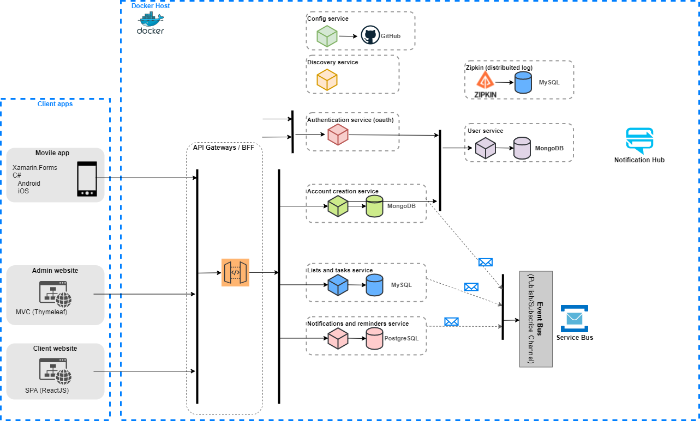

# TO-DO list

## Goal
TO-DO list and reminders for people that wants to archive its life goals.

As a second goal is to create and document a spring boot - ReactJS project using a microservices architecture.

## Architecture
The initial version of the architecture will include a lot of Spring Cloud components as:
 - **Config server**. Configuration will be in a GitHub private repo (sorry guys, but I'm planning to put very sensitive data there). I'll write what keys I'm putting on the repo, but no the actual values.
 - **Eureka**. Nothing more to say, a classic services registry.
 - **Zuul**. As API Gateway.
 - **Micrometer**. As metrics library for all the services.
 
 On the first version I'm planning to use my own _Authorization Server_ but maybe will migrate to [KeyCloak](https://www.keycloak.org/) on some point.
 
 Also, I'll use [HashiCorp's Vault](https://www.vaultproject.io/) to store secret information like passwords and keys.
 
 ###  Diagram
 
The architecture proposes a series of microservices and three applications, a mobile app developed using Xamarin.Forms, an admin website and a client´s web app.

### Modules

 - **Oauth Service**: Service to perform Authentication and Authorization.
 - **User Commons**: Entity and DTO classes used to carrying out user information between services and mapping between both kind of classes, using Mapstruct.
 - **User Service**: Internal service used to manage User's information.
 - **Test Utils**: Utilities classes used in testing among the different services.
 

#### Default port mappings
- **8761**: Eureka -Discovery- Server
- **8888**: Config Server
- **8090**: Zuul -API Gateway-
- **27017**: User's DB (Mongo)
- **27117**: Account verification's Tokens (Mongo)
- **3306**: To-do lists and tasks db (MySQL)
- **9411**: Zipkin Server
- **9090**: Prometheus
- **3001**: Grafana
- **8086**: Metrics database (InfluxDB)
- **5044**: Logstash
- **9200**: Elasticksearch
- **5601**: Kibana